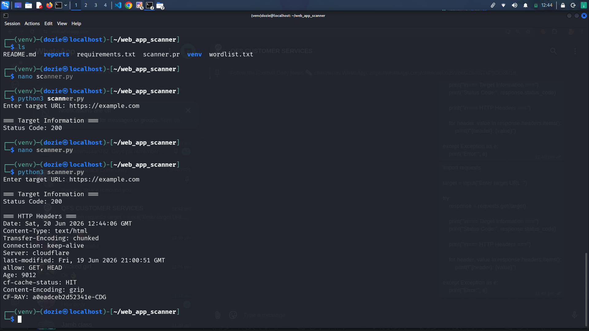
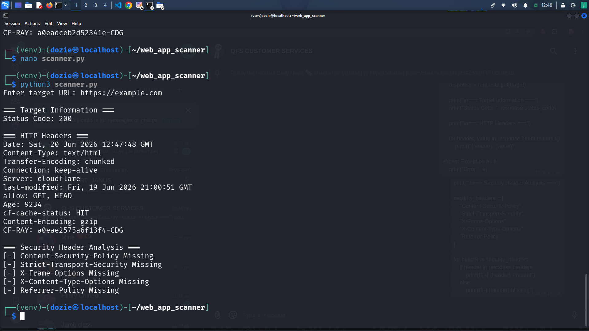
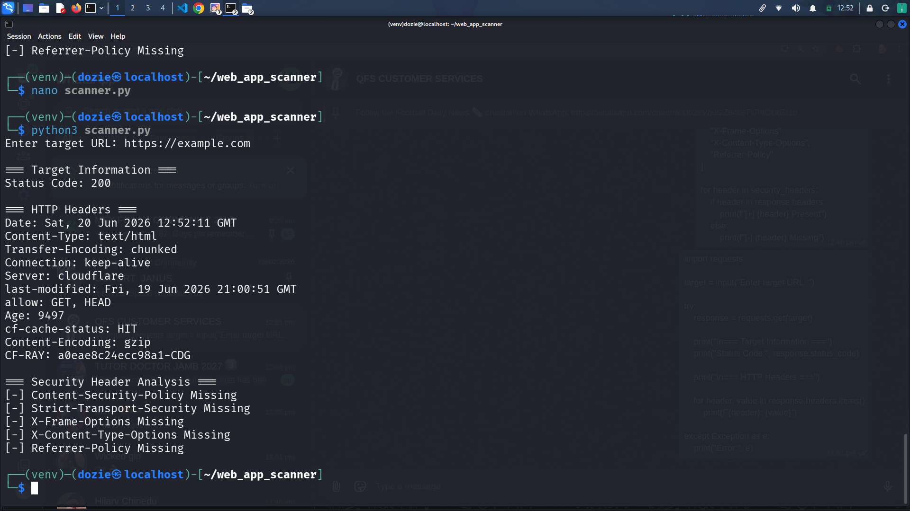
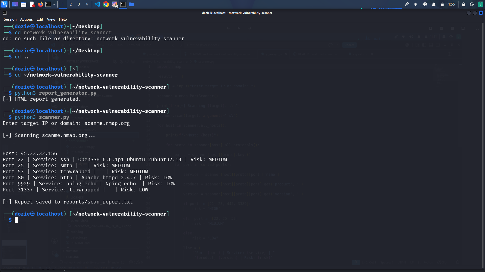
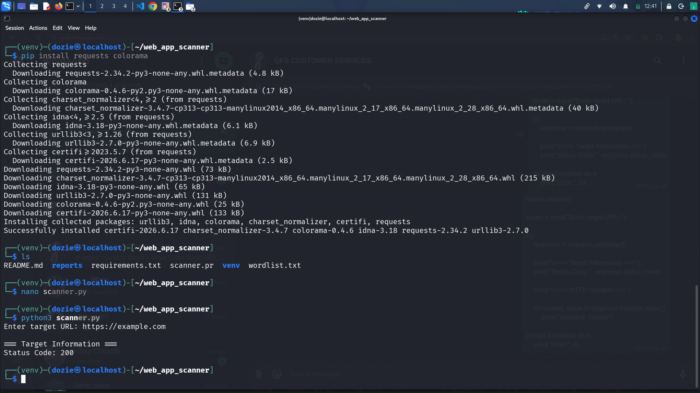
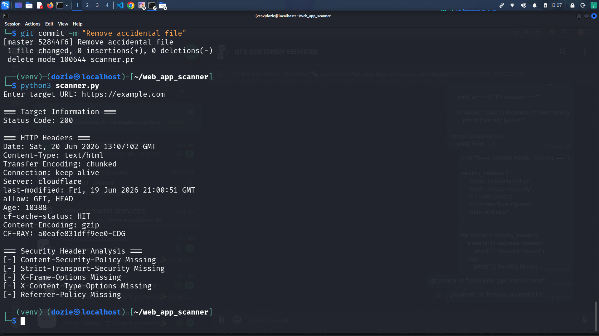

Web Application Security Scanner

Python-based Web Application Security Scanner for identifying common web security weaknesses.

Features

- HTTP Header Analysis
- Security Header Auditing
- robots.txt Analysis
- Directory Enumeration
- Risk Classification
- HTML Report Generation

Technologies Used

- Python
- Requests
- Kali Linux
- Git
- GitHub

Screenshots

Scan Output

"Scan Output" (screenshots/scan-output1.png)

Security Header Analysis

"Security Headers" (screenshots/scan-output2.png)

robots.txt Analysis

"robots.txt" (screenshots/scan-output3.png)

Directory Enumeration

"Directory Enumeration" (screenshots/scan-output4.png)

Risk Assessment

"Risk Assessment" (screenshots/scan-output5.png)

HTML Report

"HTML Report" (screenshots/scan-output10.png)

Author

Ede Chidozie Philip

GitHub: https://github.com/iamdonwisdom

## Screenshots

### Scan Output

### Security Header Analysis

### robots.txt Analysis

### Directory Enumeration

### Risk Assessment

### HTML Report

